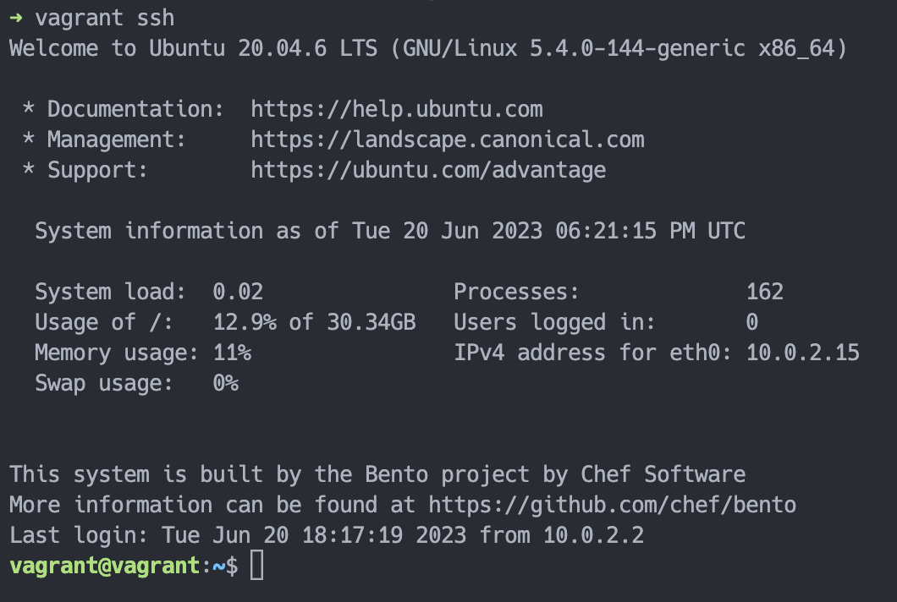
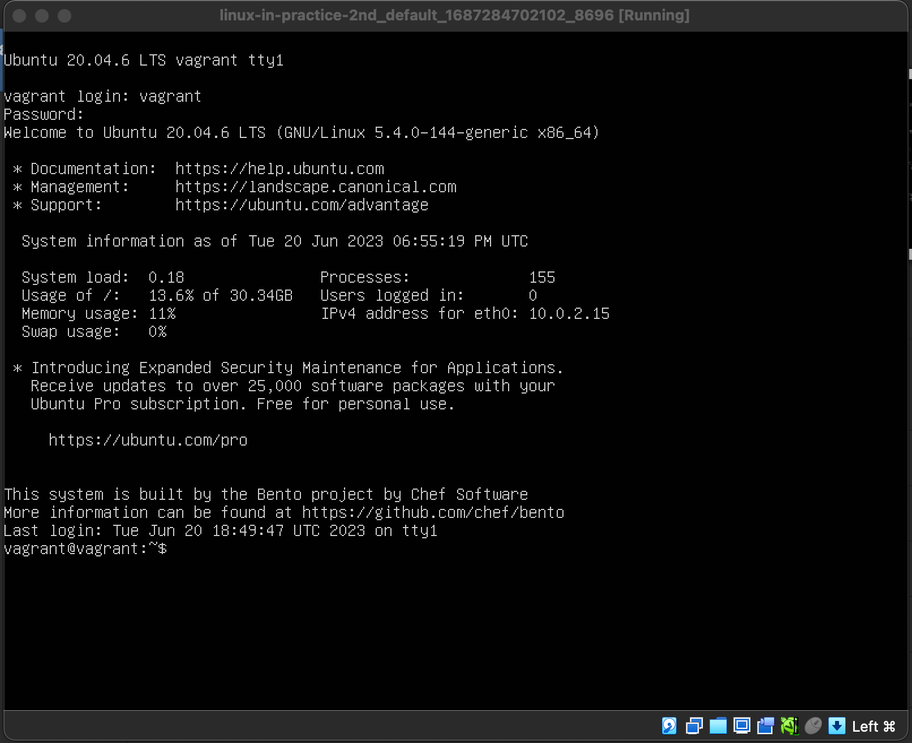
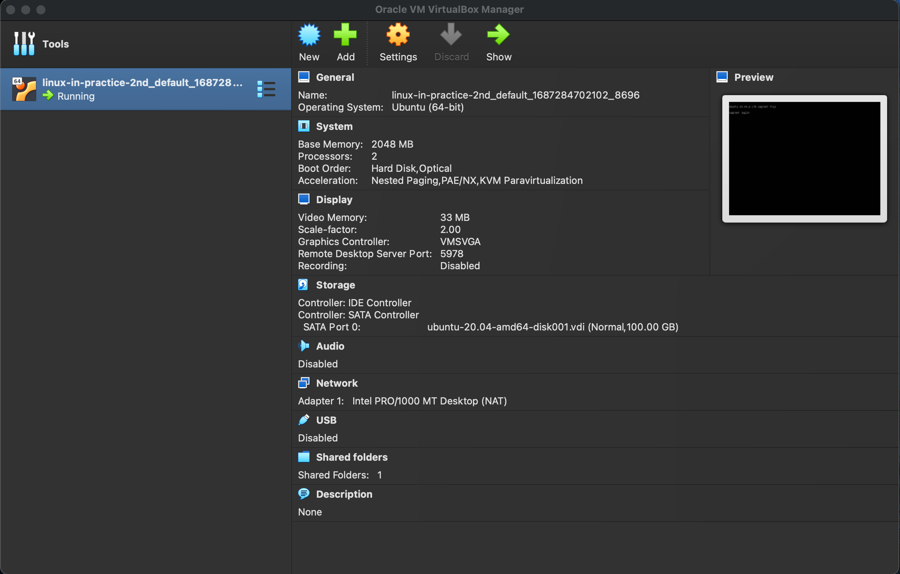

# linux-in-practice-2nd

## Links

- 書籍ページ
  - [[試して理解] Linux のしくみ - 実験と図解で学ぶ OS、仮想マシン、コンテナの基礎知識【増補改訂版】](https://gihyo.jp/book/2022/978-4-297-13148-7)（技術評論社、2022/10）
- サポートページ
  - [お詫びと訂正（正誤表）](https://gihyo.jp/book/2022/978-4-297-13148-7/support)
- サンプルコードのリポジトリ
  - [github.com/satoru-takeuchi/linux-in-practice-2nd](https://github.com/satoru-takeuchi/linux-in-practice-2nd)

## Environment

### Host

- Hardware
  - Processors: 2.3 GHz 8-Core Intel Core i9
  - Memory: 32 GB 2667 MHz DDR4
- Software
  - OS: macOS Ventura 13.4
  - VM Software
    - VirtualBox 7.0
    - Vagrant 2.3.6
    - Vagrant Plugins
      - vagrant-disksize (0.1.3, global)
      - vagrant-vbguest (0.31.0, global)

### Guest

書籍のサンプルコードを実行する環境は仮想マシン（VM）で構築する。以下のような構成の VM を Vagrant / VirtualBox で構築している（`Vagrantfile` を参照）：

- Hardware
  - 論理コア数: 4
  - 割当メモリ: 2048 MB
- Software
  - OS: Ubuntu 20.04.3 LTS [bento/ubuntu-20.04](https://app.vagrantup.com/bento/boxes/ubuntu-20.04)

> **Warning**
>
> 本書籍の著者は、実験環境について「物理マシン上にインストールした Ubuntu 20.04 / x86_64 を前提としている」と述べている。仮想マシン（VM）などの実機以外の環境では、実験プログラムが動かなかったり、予期せぬ性能特性が出たりといった不具合が発生する可能性が高いため推奨していない。
>
> 本リポジトリでは、そこを妥協して環境構築を VM で行っている。プログラムの挙動を確認する際、これを念頭に置いて結果を確認する必要がある。

## Setup

環境構築手順は以下の通り。

### Vagrant で VM 環境の構築

以下のコマンドで Vagrant を使用して VM を構築する。ネットワーク環境によるが VM の初期化に 5 ~ 10 分程度かかる：

```sh
git clone git@github.com:nukopy/linux-in-practice-2nd.git
cd linux-in-practice-2nd
vagrant up
```

### VM 環境へのログイン

以下のコマンドで VM 環境に入ることができる：

```sh
vagrant status # VM が起動中であることを確認
vagrant ssh
```

以下のように表示されればログイン成功。



### 作業ディレクトリの確認

Vagrant では "同期フォルダ" 機能を使用して、ローカル環境のディレクトリを VM 環境にマウントできる。VM 環境に入ったら、まずは以下のコマンドで作業ディレクトリを確認する：

```sh
# ----- VM 環境 -----
cd /workspace
ls
# docs  install.sh  README.md src Vagrantfile
```

### ソフトウェアのインストール

以下のコマンドで書籍を勧めていく上で必要なソフトウェアをインストールする。5 ~ 10 分程度かかる：

```sh
cd /workspace
sh install.sh
```

### VM の停止

VM を停止するにはローカル環境で以下のコマンドを実行：

```sh
vagrant halt
vagrant status # VM が停止していることを確認
```

### 補足：VM の設定

#### VM に割り当てるメモリ（RAM）、論理コア数（CPU）の設定

リポジトリルートディレクトリ配下の `Vagrantfile` の以下の箇所をいじれば OK：

```ruby
  config.vm.provider "virtualbox" do |vb|
    ...
    # 割り当てるメモリ(MB)
    vb.memory = 2048

    # CPU の数（論理コア数）
    vb.cpus = 4
    ...
  end
```

`Vagrantfile` を更新したら、以下のコマンドを実行して VM を再起動する：

```sh
vagrant reload
```

#### VM の GUI を表示したい場合

（このリポジトリの環境構築の）デフォルトでは、VM はヘッドレスモードで起動する。VM の GUI を起動したい場合、`Vagrantfile` を以下のように編集する：

```diff
  config.vm.provider "virtualbox" do |vb|
    ...
-    vb.gui = false
+    vb.gui = true
    ...
  end
```

`Vagrantfile` を更新したら、以下のコマンドを実行して VM を再起動する：

```sh
vagrant reload
```

再起動後、VirtualBox によって以下のようにログインプロンプトが GUI で表示される。ログイン情報はユーザ名 `vagrant`、パスワード `vagrant` で OK：



ちなみに、VirtualBox のアプリを開くと、以下のように VM のシステム情報を確認できる：


